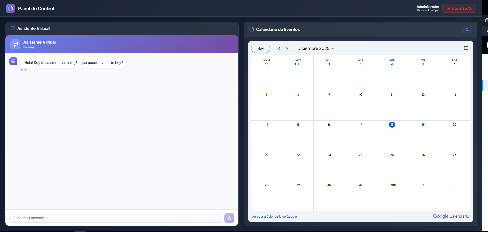
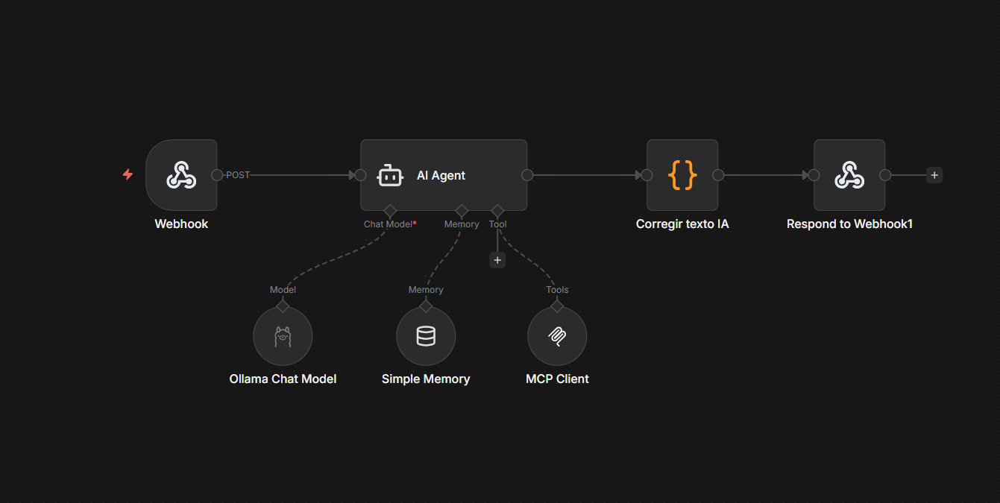
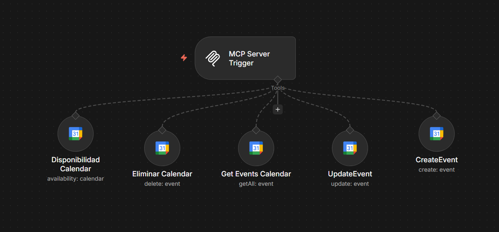
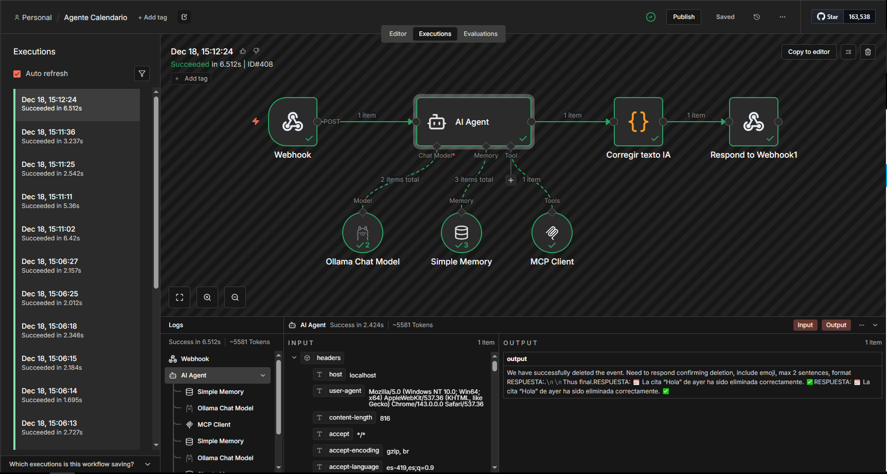

# 📅 Sistema de Gestión de Calendario con IA

Una aplicación web moderna que integra un asistente virtual inteligente con Google Calendar, permitiendo gestionar eventos mediante conversación natural.


## 🌟 Características

- 🤖 **Asistente Virtual Inteligente**: Chatbot con IA que entiende lenguaje natural
- 📆 **Integración con Google Calendar**: Visualización en tiempo real de eventos
- 🔄 **Actualización Automática**: El calendario se actualiza automáticamente al crear eventos
- 🔐 **Autenticación JWT**: Comunicación segura con n8n
- 📱 **Diseño Responsive**: Optimizado para desktop, tablet y móvil
- 🎨 **UI Moderna**: Interfaz elegante con gradientes y animaciones suaves

## 🖼️ Capturas de Pantalla

### Dashboard Principal


### Chatbot en Acción


## 🏗️ Arquitectura del Sistema

### Flujo de Datos

```
Usuario → React App → n8n Webhook → AI Agent → Google Calendar
                ↓                         ↓
            JWT Auth              Procesamiento IA
                ↓                         ↓
         Validación            Extracción de Datos
                ↓                         ↓
            Response ← Respuesta en Texto ← Acción en Calendar
```

### Componentes Principales

1. **Frontend (React + Vite)**
   - `Login.jsx`: Autenticación de usuarios
   - `Dashboard.jsx`: Panel principal con calendario y chat
   - `Chatbot.jsx`: Interfaz del asistente virtual
   - `chatbotService.js`: Lógica de comunicación con n8n

2. **Backend (n8n)**
   - **Webhook**: Recibe peticiones del frontend
   - **AI Agent**: Procesa el lenguaje natural con Ollama
   - **Google Calendar API**: Gestiona eventos (crear, eliminar, actualizar, consultar)
   - **Memory**: Mantiene el contexto de la conversación

## 🔧 Configuración de n8n

### 1. Workflow Principal - Agente de Calendario

Este workflow maneja todas las interacciones con el calendario:

**Nodos principales:**
- **MCP Server Trigger**: Punto de entrada para las operaciones
- **Disponibilidad Calendar**: Verifica disponibilidad de horarios
- **Eliminar Calendar**: Elimina eventos existentes
- **Get Events Calendar**: Obtiene lista de eventos
- **UpdateEvent**: Modifica eventos existentes
- **CreateEvent**: Crea nuevos eventos



### 2. Workflow de Chat - Agente IA

Este workflow procesa las conversaciones con el usuario:

**Nodos principales:**
- **Webhook**: Recibe mensajes del frontend
- **AI Agent**: Procesa con modelo Ollama Chat
- **Simple Memory**: Mantiene contexto de conversación
- **MCP Client**: Conecta con las herramientas de calendario
- **Corregir texto IA**: Formatea la respuesta
- **Respond to Webhook**: Envía respuesta al frontend



### Configuración del Webhook en n8n

1. **URL del Webhook**: `https://n8n.**********************`
2. **Método**: POST
3. **Autenticación**: JWT Bearer Token
4. **Headers requeridos**:
   ```json
   {
     "Content-Type": "application/json",
     "Authorization": "Bearer <JWT_TOKEN>"
   }
   ```

5. **Body de la petición**:
   ```json
   {
     "sessionId": "user_admin",
     "message": "crea un evento hoy a las 4pm de fútbol",
     "timestamp": "2025-12-18T15:30:00.000Z",
     "conversationHistory": []
   }
   ```

6. **Respuesta esperada** (texto plano):
   ```
   ✅ Cita "Fútbol ⚽" creada hoy de 16:00 a 17:00. 📅
   ```

### Configuración de Google Calendar API

1. Crear proyecto en Google Cloud Console
2. Habilitar Google Calendar API
3. Crear credenciales OAuth 2.0
4. Configurar el nodo de Google Calendar en n8n con las credenciales

## 🚀 Instalación y Configuración

### Prerrequisitos

- Node.js 18+ 
- npm o yarn
- Cuenta de n8n (cloud o self-hosted)
- Cuenta de Google con Calendar API habilitada

### 1. Clonar el Repositorio

```bash
git clone https://github.com/tu-usuario/calendario-eventos.git
cd calendario-eventos/mi-app
```

### 2. Instalar Dependencias

```bash
npm install
```

### 3. Configurar Variables de Entorno

Crea un archivo `.env` en la raíz del proyecto:

```env
VITE_CHATBOT_WEBHOOK_URL=https://n8n************
VITE_CHATBOT_JWT_SECRET=************************
```

### 4. Configurar n8n

#### Importar Workflows

1. Accede a tu instancia de n8n
2. Importa los workflows desde la carpeta `n8n-workflows/`
3. Configura las credenciales de Google Calendar
4. Configura el modelo de IA (Ollama)
5. Activa los workflows

#### Configurar el Webhook

En el nodo "Respond to Webhook":
- **Response Mode**: Text
- **Response Body**: `{{ $json.output }}`

### 5. Ejecutar en Desarrollo

```bash
npm run dev
```

La aplicación estará disponible en `http://localhost:5173`

### 6. Construir para Producción

```bash
npm run build
```

Los archivos optimizados estarán en la carpeta `dist/`

## 🔐 Autenticación

### Sistema de Login

- **Usuario**: `admin`
- **Contraseña**: `admin123`

> ⚠️ **Importante**: Cambiar estas credenciales en producción

### JWT Token

El sistema genera automáticamente tokens JWT con:
- **Algoritmo**: HS256
- **Expiración**: 1 hora
- **Payload**: `{ iat, exp }`

## 📱 Uso de la Aplicación

### 1. Iniciar Sesión

Accede con las credenciales configuradas.

### 2. Interactuar con el Chatbot

Ejemplos de comandos:

```
"Crea un evento mañana a las 3pm de reunión"
"Elimina el evento de hoy a las 4pm"
"¿Qué eventos tengo para mañana?"
"Modifica el evento de fútbol para las 5pm"
"¿Estoy libre el viernes a las 2pm?"
```

### 3. Visualizar el Calendario

- El calendario se actualiza automáticamente al crear eventos
- Puedes usar el botón de refrescar manual si es necesario
- Los eventos se sincronizan con tu Google Calendar

## 🛠️ Tecnologías Utilizadas

### Frontend
- **React 18.3**: Framework de UI
- **Vite 7.3**: Build tool y dev server
- **CSS3**: Estilos con variables y gradientes
- **Web Crypto API**: Generación de JWT

### Backend/Automation
- **n8n**: Plataforma de automatización
- **Ollama**: Modelo de IA local
- **Google Calendar API**: Gestión de eventos

### Infraestructura
- **JWT**: Autenticación

## 📂 Estructura del Proyecto

```
mi-app/
├── src/
│   ├── components/
│   │   ├── Login.jsx          # Componente de login
│   │   ├── Login.css
│   │   ├── Dashboard.jsx      # Panel principal
│   │   ├── Dashboard.css
│   │   ├── Chatbot.jsx        # Chatbot
│   │   └── Chatbot.css
│   ├── services/
│   │   └── chatbotService.js  # Lógica de comunicación
│   ├── config/
│   │   └── chatbotConfig.js   # Configuración
│   ├── App.jsx
│   ├── App.css
│   └── main.jsx
├── public/
├── .env.example
├── vite.config.js
├── package.json
└── README.md
```

## 🔄 Flujo de Creación de Eventos

1. **Usuario escribe**: "crea un evento hoy a las 4pm de fútbol"
2. **Frontend**: Genera JWT y envía petición a n8n
3. **n8n Webhook**: Recibe y valida el token
4. **AI Agent**: Procesa el mensaje con Ollama
5. **MCP Client**: Identifica la acción (crear evento)
6. **Google Calendar**: Crea el evento
7. **Respuesta**: "✅ Cita 'Fútbol ⚽' creada hoy de 16:00 a 17:00. 📅"
8. **Frontend**: Detecta ✅ y actualiza el calendario automáticamente

## 🎨 Personalización

### Cambiar Colores

Edita las variables CSS en `src/index.css`:

```css
:root {
  --primary: #667eea;
  --primary-light: #764ba2;
  --text-primary: #f1f5f9;
  --text-secondary: #94a3b8;
}
```

### Modificar el Calendario

Edita la URL del iframe en `Dashboard.jsx`:

```javascript
const calendarUrl = `https://calendar.google.com/calendar/embed?src=TU_EMAIL...`;
```

## 🐛 Solución de Problemas

### El chatbot no responde

1. Verifica que n8n esté activo
2. Revisa las credenciales JWT
3. Comprueba la URL del webhook
4. Verifica los logs de n8n

### El calendario no se actualiza

1. Verifica la conexión con Google Calendar API
2. Comprueba que el evento se creó en Google Calendar
3. Usa el botón de refrescar manual
4. Revisa que la respuesta contenga el emoji ✅

### Error de CORS

Asegúrate de que n8n tenga configurado CORS correctamente:
```
Access-Control-Allow-Origin: *
Access-Control-Allow-Methods: POST, OPTIONS
```

## 📝 Licencia

MIT License - ver [LICENSE](LICENSE) para más detalles

## 👤 Autor

**Aldair Domínguez**
- GitHub: [@aldairdominguez](https://github.com/aldairdominguez)
- Website: [aldairdominguez.tech](https://aldairdominguez.tech)

## 🤝 Contribuciones

Las contribuciones son bienvenidas. Por favor:

1. Fork el proyecto
2. Crea una rama para tu feature (`git checkout -b feature/AmazingFeature`)
3. Commit tus cambios (`git commit -m 'Add some AmazingFeature'`)
4. Push a la rama (`git push origin feature/AmazingFeature`)
5. Abre un Pull Request

## 📧 Contacto

Para preguntas o sugerencias, contacta a través de:
- Email: aldair30d@gmail.com
- LinkedIn: [Aldair Domínguez](https://www.linkedin.com/in/aldairdz/)

---

⭐ Si este proyecto te fue útil, considera darle una estrella en GitHub!
